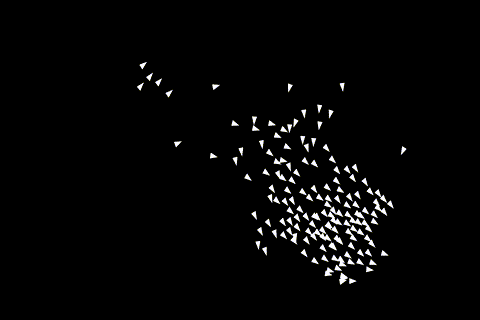

# Lloids (boids)

An implementation of a bird murmuration in Rust using Craig Reynold's _Boids_ algorithm.

## Keyboard shortcuts

- t: Toggle trails
- d: Toggle debug menu
- b: Toggle turn box 
- r: Toggle bird radii
- p: Pause

## Further reading
* [1] [C. Reynolds - Flocks, herds and schools: A distributed behavioral model](https://dl.acm.org/doi/10.1145/37401.37406)
* [2] [Craig Reynolds - Boids, background and update](http://www.red3d.com/cwr/boids/)

